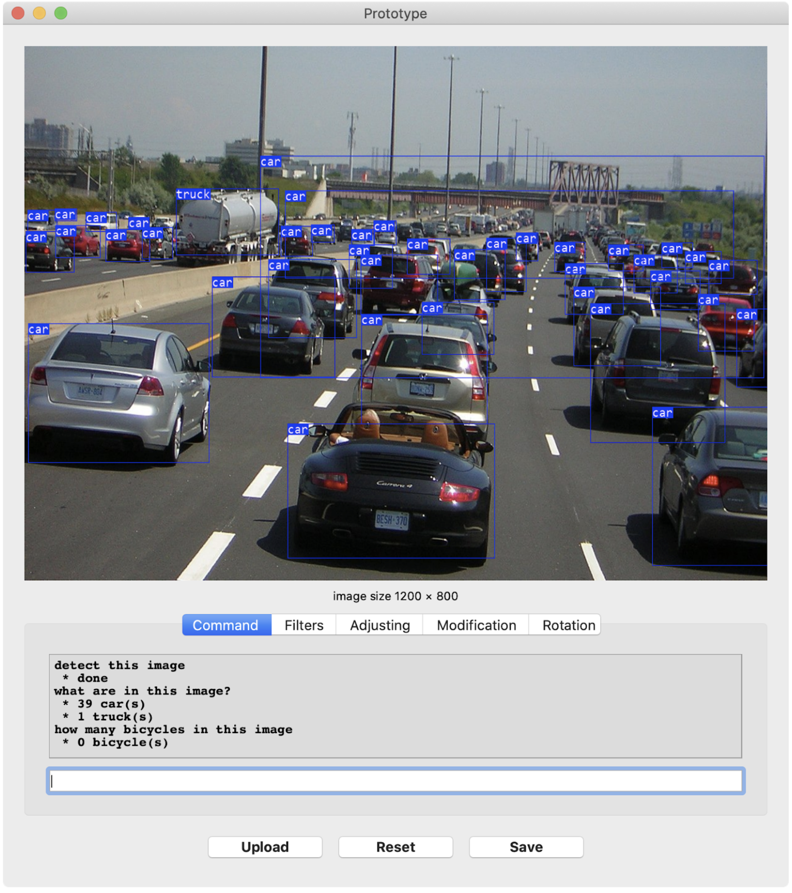

# DSL4IP: A Domain-specific language for Image Processing

## Reference

- https://github.com/lark-parser/lark
- https://pypi.org/project/darknetpy/
- https://github.com/oarriaga/face_classification
- https://pypi.org/project/py-agender/
- https://github.com/himanshumishra78/project_food_recommended_and_detection
- https://github.com/shkolovy/simple-photo-editor
